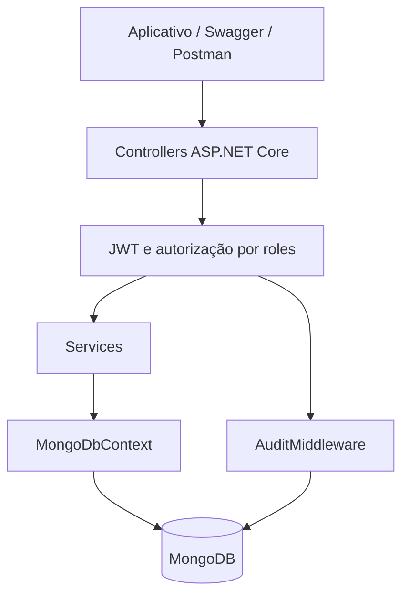

# InovaGAB API

> **FIAP — Challenge 2026 | Grupo Águia Branca**


API REST desenvolvida para gestão de inovação corporativa. Operadores submetem ideias, gestores avaliam propostas e acompanham projetos, e líderes administram diretrizes estratégicas e consultam indicadores executivos.

## Execução rápida para avaliação

### Pré-requisitos

- Docker Desktop com Docker Compose; ou
- .NET 8 SDK e uma instância MongoDB acessível.

### Executar com Docker Compose

Na raiz do repositório, crie o arquivo de ambiente a partir do exemplo.

PowerShell:

```powershell
Copy-Item .env.example .env
```

Bash:

```bash
cp .env.example .env
```

Edite o `.env` e defina uma chave JWT com pelo menos 32 caracteres:

```dotenv
JWT_KEY=substitua_por_uma_chave_segura_com_32_caracteres
```

Suba a aplicação:

```bash
docker compose up --build -d
```

Verifique os serviços:

```bash
docker compose ps
```

Acesse:

- Swagger: <http://localhost:8080/swagger>
- Health do MongoDB: <http://localhost:8080/api/health/mongo>
- OpenAPI JSON: <http://localhost:8080/swagger/v1/swagger.json>

Para encerrar sem excluir os dados:

```bash
docker compose down
```

> Não use `docker compose down -v` se quiser preservar o volume do MongoDB.

## Usuários de demonstração

O Seeder cria os seguintes usuários na primeira inicialização:

| Perfil | E-mail | Senha |
| --- | --- | --- |
| Operator | `joao.operador@aguiabranca.com.br` | `senha123` |
| Operator | `maria.operador@aguiabranca.com.br` | `senha123` |
| Manager | `ana.gestora@aguiabranca.com.br` | `senha123` |
| Leader | `carlos.lider@aguiabranca.com.br` | `senha123` |

Essas credenciais existem exclusivamente para demonstração e desenvolvimento.

## Visão geral

Fluxo principal da plataforma:

```text
Operador submete uma ideia
        ↓
Gestor avalia, pontua e aprova ou rejeita
        ↓
Gestor vincula a ideia a um projeto
        ↓
Gestor acompanha investimento, prazo, progresso e retorno
        ↓
Liderança consulta métricas no dashboard executivo
```

A liderança também administra diretrizes estratégicas e desafios internos de inovação.

## Arquitetura



Organização lógica:

```text
Controller
    ↓
Service
    ↓
MongoDbContext / IMongoCollection<T>
    ↓
MongoDB.Driver
    ↓
MongoDB
```

As relações entre collections são mantidas por referências manuais com `ObjectId`. Os Services carregam os documentos relacionados quando necessário; objetos completos de navegação não são duplicados nos documentos.

## Tecnologias

| Tecnologia | Versão | Responsabilidade |
| --- | --- | --- |
| .NET / ASP.NET Core | 8.0 | Plataforma da API |
| MongoDB | 8 | Banco NoSQL orientado a documentos |
| MongoDB.Driver | 3.11.1 | Acesso nativo a collections, filtros e updates |
| JWT Bearer | 8.0.20 | Autenticação e autorização |
| BCrypt.Net-Next | 4.1.0 | Hash e validação de senhas |
| Swashbuckle | 6.9.0 | Swagger e especificação OpenAPI |
| Google Gemini API | gemini-3.5-flash-lite | Sugestão de score por IA (opcional) |
| Docker Compose | — | Execução da API e do MongoDB |

O projeto não utiliza Entity Framework Core, Npgsql, PostgreSQL ou migrations relacionais.

## Persistência MongoDB

Banco padrão:

```text
InovaGab
```

Collections:

| Collection | Conteúdo |
| --- | --- |
| `users` | Usuários, roles, credenciais e pontos |
| `ideas` | Ideias submetidas e avaliações |
| `projects` | Projetos, progresso e resultados financeiros |
| `challenges` | Desafios de inovação |
| `strategicGuidelines` | Diretrizes estratégicas |
| `auditLogs` | Auditoria das requisições |

### Convenções BSON

- identificadores são `ObjectId`, representados como `string` na API;
- propriedades são armazenadas em `camelCase`;
- enums são armazenados como texto;
- valores monetários são armazenados como `Decimal128`;
- propriedades calculadas e navegações são ignoradas na serialização;
- campos adicionais são tolerados na leitura para facilitar evolução de schema.

### Índices

A aplicação cria os índices necessários durante a inicialização, incluindo:

- e-mail de usuário único;
- usuário, desafio e status de ideias;
- gestor, ideia e status de projetos;
- diretrizes ativas por data;
- diretrizes por linha de histórico (`rootId`), com índice único parcial garantindo uma única versão vigente (`isCurrent = true`) por linha;
- `guidelineId` de ideias e projetos, para consultas e agregações por estratégia;
- desafios ativos por prazo;
- logs de auditoria por data.

Não existem migrations de schema. Alterações de documentos e índices são administradas pelo código de inicialização e pela compatibilidade de leitura BSON.

## Modelos principais

Todos os campos `Id`, `UserId`, `ManagerId`, `IdeaId`, `ChallengeId` e `CreatedById` relacionados a documentos são strings no contrato HTTP e representam `ObjectId` do MongoDB.

### User

| Campo | Tipo | Descrição |
| --- | --- | --- |
| `Id` | string/ObjectId | Identificador |
| `Name` | string | Nome completo |
| `Email` | string | E-mail normalizado usado no login |
| `PasswordHash` | string | Hash BCrypt da senha |
| `Role` | UserRole | `Operator`, `Manager` ou `Leader` |
| `Division` | string | Área da empresa |
| `Points` | int | Pontuação por contribuições |

### Idea

| Campo | Tipo | Descrição |
| --- | --- | --- |
| `Id` | string/ObjectId | Identificador |
| `UserId` | string/ObjectId | Autor da ideia |
| `ChallengeId` | string/ObjectId? | Desafio opcional |
| `GuidelineId` | string/ObjectId? | Diretriz estratégica vinculada (opcional) |
| `Status` | IdeaStatus | `Submitted`, `UnderReview`, `Approved` ou `Rejected` |
| `Priority` | IdeaPriority | `Low`, `Medium`, `High` ou `Critical`; triagem do Manager, sem relação com a prioridade da diretriz |
| `ImpactScore` | int | Impacto de 0 a 10 |
| `FeasibilityScore` | int | Viabilidade de 0 a 10 |
| `AlignmentScore` | int | Alinhamento de 0 a 10 |
| `TotalScore` | int | Média calculada, não persistida |
| `IsDeleted` | bool | Exclusão lógica (ver "Regras de negócio: Ideia") |

### Project

| Campo | Tipo | Descrição |
| --- | --- | --- |
| `Id` | string/ObjectId | Identificador |
| `ManagerId` | string/ObjectId | Gestor responsável |
| `IdeaId` | string/ObjectId? | Ideia de origem |
| `GuidelineId` | string/ObjectId? | Diretriz estratégica vinculada (opcional) |
| `Status` | ProjectStatus | Estado do projeto |
| `Stage` | ProjectStage | Etapa atual |
| `Investment` | Decimal128 | Investimento |
| `FinancialReturn` | Decimal128 | Retorno financeiro |
| `Roi` | decimal | ROI calculado, não persistido (ver "Regras de negócio: Projeto") |
| `ProductivityGain` | int | Ganho de produtividade |
| `ProgressPercent` | int | Progresso de 0 a 100 |
| `IsArchived` | bool | Arquivamento lógico (ver "Regras de negócio: Projeto") |

### StrategicGuideline

Representa uma diretriz estratégica **versionada**: cada atualização gera um novo documento (nova versão), preservando o anterior como histórico. Nenhuma atualização apaga ou sobrescreve uma versão já existente.

| Campo | Tipo | Descrição |
| --- | --- | --- |
| `Id` | string/ObjectId | Identificador desta versão |
| `RootId` | string/ObjectId | Identificador da primeira versão da linha de histórico; igual em todas as versões geradas a partir dela |
| `PreviousVersionId` | string/ObjectId? | Versão anterior desta linha, quando esta versão veio de uma atualização |
| `Version` | int | Número sequencial da versão dentro da linha, começando em 1 |
| `IsCurrent` | bool | `true` somente na versão vigente da linha; garantido único por `RootId` via índice |
| `IsActive` | bool | `false` quando a diretriz foi desativada (exclusão lógica) |
| `Category` | string | Categoria da diretriz |
| `Campaign` | string | Campanha institucional vinculada (ex.: "InovaGAB 2026") |
| `Priority` | GuidelinePriority | `Low`, `Medium` ou `High` |

Ao atualizar uma diretriz (`PUT /api/Guideline/{id}`), a API cria uma nova versão vigente e marca a versão anterior como `IsCurrent = false`, sem excluí-la; o histórico completo continua disponível em `GET /api/Guideline/{id}/history`. `GET /api/Guideline` lista apenas as versões vigentes (`IsActive && IsCurrent`), garantindo que a estratégia atual de cada linha seja sempre inequívoca.

## Regras de negócio: Ideia

**Ownership e acesso.** `GET /api/Idea/{id}` retorna `400` para `ObjectId` inválido e `404` se a ideia não existir (ou já tiver sido excluída). Um `Operator` só acessa/edita/exclui as próprias ideias (`403` caso contrário); `Manager` e `Leader` consultam qualquer ideia.

**Edição (`PUT /api/Idea/{id}`).** Só o autor edita, e só enquanto `Status = Submitted` (`400` fora disso). O corpo aceita apenas `Title`, `Description`, `Division`, `EvidenceUrl`, `ChallengeId` e `GuidelineId`; autor, scores, status e prioridade não fazem parte do payload, então não há como alterá-los por este endpoint.

**Exclusão (`DELETE /api/Idea/{id}`).** Decisão: **exclusão lógica** (`IsDeleted = true`), não física. Motivo: uma ideia pode já ter gerado auditoria, e o registro precisa poder ser referenciado/consultado no histórico sem risco de ponteiros quebrados caso outra entidade venha a citá-la. Ideias excluídas somem das listagens e do `GET /api/Idea/{id}` (404), mas o documento continua no banco. Só o autor exclui, e só antes da avaliação (`Status = Submitted`; `400` caso já tenha sido avaliada).

**Priorização (`PATCH /api/Idea/{id}/prioritize`).** Exclusiva do `Manager`. `Priority` é um enum próprio (`Low`, `Medium`, `High`, `Critical`, padrão `Medium`), independente da prioridade da diretriz vinculada. A operação é registrada no `AuditLog` automaticamente pelo middleware de auditoria (toda requisição autenticada é auditada com método, rota, usuário e status).

**Aprovação/rejeição.** Scores fora de `0-10` retornam `400`. Reaprovar uma ideia já aprovada é permitido (para ajustar scores), mas o bônus de 50 pontos só é concedido na primeira aprovação. Uma ideia `Rejected` não pode ser aprovada diretamente, e só ideias em `Submitted`/`UnderReview` podem ser rejeitadas.

## Regras de negócio: Projeto

**Acesso.** Criação, atualização e exclusão são exclusivas do `Manager`. `Manager` e `Leader` consultam listagem, detalhe e (novo) o drill-down de dashboard por projeto.

**Validações.** `Investment` e `FinancialReturn` não podem ser negativos; `ProgressPercent` deve estar entre `0` e `100`; `Deadline` não pode ser anterior a `StartDate`. Qualquer violação retorna `400`.

**Transições de status.** `Planning → InProgress/Cancelled`; `InProgress → OnHold/Completed/Cancelled`; `OnHold → InProgress/Cancelled`; `Completed` e `Cancelled` são estados finais. Transições fora dessa matriz retornam `400`.

**Transições de etapa.** Sequencial e só para frente: `Diagnosis → Implementation → Validation → Closure`. Voltar etapa retorna `400`.

**Exclusão (`DELETE /api/Project/{id}`).** Decisão: **arquivamento lógico** (`IsArchived = true`), não exclusão física. Motivo: o projeto carrega investimento e retorno financeiro que compõem o ROI consolidado e o dashboard por estratégia; apagar o documento distorceria os totais históricos. Projetos arquivados saem de `GET /api/Project` (listagem padrão), mas continuam acessíveis por `GET /api/Project/{id}` e pelo dashboard.

**ROI sem retorno financeiro.** Enquanto `FinancialReturn` for `0`, `Roi` retorna `0` em vez de `-100%`. Decisão: um projeto recém-iniciado, sem retorno lançado ainda, não perdeu o investimento; `0` comunica "ainda não há dado", enquanto `-100%` sugeriria perda total incorreta.

## Sugestão de score por IA

Provedor escolhido: **Google Gemini** (API pública, `generativelanguage.googleapis.com`), modelo padrão `gemini-3.5-flash-lite` (rápido e barato, adequado para triagem; configurável sem alterar código).

```http
POST /api/Idea/{id}/ai-score
```

Exclusivo do `Manager`. A IA analisa título, descrição e a diretriz estratégica vinculada (quando houver) e responde com uma sugestão; **nada é persistido ou aprovado automaticamente**, a decisão final continua sendo do gestor:

```json
{
  "impactScore": 8,
  "feasibilityScore": 6,
  "alignmentScore": 9,
  "justification": "Reduz retrabalho manual e está alinhado à diretriz de digitalização.",
  "model": "gemini-3.5-flash-lite"
}
```

**Configuração.** A chave fica somente em `.env` (`GEMINI_API_KEY`, repassada ao container como `Gemini__ApiKey`) ou em `dotnet user-secrets` para rodar fora do Docker; nunca em `appsettings.json` nem versionada. `.env.example` documenta a variável sem valor real.

**Indisponibilidade.** Sem chave configurada, timeout (padrão 20s, cancelável junto com a requisição), erro do provedor ou JSON fora do formato esperado, o endpoint responde `502 Bad Gateway` com uma mensagem genérica; a avaliação manual (`PATCH /api/Idea/{id}/approve`/`reject`) nunca é bloqueada por isso. Scores fora de `0-10` na resposta da IA também são tratados como indisponibilidade.

**Segurança.** A chave nunca é logada; falhas registram apenas tipo de erro e id da ideia, sem o prompt ou a resposta do provedor. Cada chamada é registrada no `AuditLog` pelo `AuditMiddleware`, que já audita toda requisição autenticada (método, rota, usuário, status).

## Autenticação e autorização

A API utiliza JWT assinado com HMAC SHA-256. O token contém:

- identificador MongoDB do usuário;
- e-mail;
- nome;
- role.

Validade padrão do token: 8 horas.

Para autenticar no Swagger:

1. execute `POST /api/Auth/login`;
2. copie apenas o campo `token`;
3. clique em **Authorize**;
4. informe `Bearer SEU_TOKEN`.

O cadastro público sempre cria um usuário `Operator`. Campos extras tentando definir `Manager` ou `Leader` são ignorados. Os perfis privilegiados de demonstração são criados pelo Seeder.

## Matriz de acesso

| Recurso | Operator | Manager | Leader |
| --- | ---: | ---: | ---: |
| Cadastrar ideia | Sim | Não | Não |
| Consultar próprias ideias | Sim | Não | Não |
| Consultar/editar/excluir a própria ideia por id | Sim | Não | Não |
| Consultar todas as ideias | Não | Sim | Sim |
| Priorizar ideia | Não | Sim | Não |
| Aprovar ou rejeitar ideia | Não | Sim | Não |
| Criar, atualizar e arquivar projeto | Não | Sim | Não |
| Consultar projetos | Não | Sim | Sim |
| Gerenciar diretrizes | Não | Não | Sim |
| Consultar diretrizes | Sim | Sim | Sim |
| Gerenciar desafios | Não | Não | Sim |
| Consultar desafios | Sim | Sim | Sim |
| Consultar dashboard | Não | Não | Sim |

Respostas esperadas:

- `401 Unauthorized`: token ausente ou inválido;
- `403 Forbidden`: usuário autenticado sem a role exigida;
- `400 Bad Request`: dados ou `ObjectId` inválidos;
- `404 Not Found`: recurso não encontrado.

## Endpoints

### Autenticação

| Método | Rota | Acesso | Descrição |
| --- | --- | --- | --- |
| POST | `/api/Auth/register` | Público | Cadastra um operador |
| POST | `/api/Auth/login` | Público | Autentica e gera JWT |

Cadastro:

```json
{
  "name": "João Silva",
  "email": "joao@empresa.com",
  "password": "Senha@123",
  "division": "Tecnologia"
}
```

Login:

```json
{
  "email": "joao@empresa.com",
  "password": "Senha@123"
}
```

### Ideias

| Método | Rota | Acesso | Descrição |
| --- | --- | --- | --- |
| POST | `/api/Idea` | Operator | Submete uma ideia |
| GET | `/api/Idea/my` | Operator | Lista as ideias do usuário |
| GET | `/api/Idea` | Manager, Leader | Lista todas as ideias por score |
| GET | `/api/Idea/{id}` | Operator (dona), Manager, Leader | Detalha uma ideia |
| PUT | `/api/Idea/{id}` | Operator (dona) | Edita a ideia enquanto `Status = Submitted` |
| DELETE | `/api/Idea/{id}` | Operator (dona) | Exclui logicamente a ideia antes da avaliação |
| PATCH | `/api/Idea/{id}/prioritize` | Manager | Define a prioridade de triagem |
| POST | `/api/Idea/{id}/ai-score` | Manager | Sugestão de score por IA (ver "Sugestão de score por IA") |
| PATCH | `/api/Idea/{id}/approve` | Manager | Aprova e pontua uma ideia |
| PATCH | `/api/Idea/{id}/reject` | Manager | Rejeita uma ideia |

Criação:

```json
{
  "title": "Automação do processo X",
  "description": "Reduzir tempo manual usando automação.",
  "division": "Operações",
  "evidenceUrl": "https://example.com/evidencia",
  "challengeId": "66d1234567890abcdef12345",
  "guidelineId": "66d1234567890abcdef54321"
}
```

`challengeId` e `guidelineId` são opcionais e podem ser `null`. Quando informado, `guidelineId` deve apontar para uma diretriz existente e ativa (`400 Bad Request` caso contrário). A resposta traz `guidelineId` e um resumo em `guideline` (`id`, `title`, `category`, `campaign`, `isActive`), sem exigir uma consulta adicional a `GET /api/Guideline/{id}`.

Edição (`PUT`, todos os campos opcionais):

```json
{
  "title": "Automação do processo X (revisado)",
  "guidelineId": "66d1234567890abcdef54321"
}
```

Priorização:

```json
{
  "priority": "High"
}
```

Aprovação:

```json
{
  "impactScore": 8,
  "feasibilityScore": 7,
  "alignmentScore": 9
}
```

### Projetos

| Método | Rota | Acesso | Descrição |
| --- | --- | --- | --- |
| POST | `/api/Project` | Manager | Cria um projeto |
| GET | `/api/Project` | Manager, Leader | Lista projetos ativos (não arquivados) |
| GET | `/api/Project/{id}` | Manager, Leader | Detalha um projeto (inclusive arquivado) |
| PUT | `/api/Project/{id}` | Manager | Atualiza um projeto |
| DELETE | `/api/Project/{id}` | Manager | Arquiva logicamente o projeto |

Criação:

```json
{
  "title": "Projeto RPA Operações",
  "description": "Automação de processos manuais",
  "division": "Operações",
  "investment": 50000,
  "startDate": "2026-09-10T00:00:00Z",
  "deadline": "2026-12-20T23:59:59Z",
  "ideaId": "66d1234567890abcdef12345",
  "guidelineId": "66d1234567890abcdef54321"
}
```

`ideaId` e `guidelineId` são opcionais e podem ser `null`. Quando informado, `guidelineId` deve apontar para uma diretriz existente e ativa (`400 Bad Request` caso contrário). A resposta traz `guidelineId` e um resumo em `guideline`, sem exigir uma consulta adicional.

Atualização:

```json
{
  "status": 1,
  "stage": 1,
  "financialReturn": 150000,
  "productivityGain": 30,
  "progressPercent": 65,
  "guidelineId": "66d1234567890abcdef54321"
}
```

`guidelineId` na atualização é opcional; quando enviado, substitui o vínculo atual do projeto (mesma validação de existência e diretriz ativa).

### Desafios

| Método | Rota | Acesso | Descrição |
| --- | --- | --- | --- |
| POST | `/api/Challenge` | Leader | Cria um desafio |
| GET | `/api/Challenge` | Autenticado | Lista desafios ativos |
| GET | `/api/Challenge/{id}` | Autenticado | Detalha um desafio e suas ideias |
| PUT | `/api/Challenge/{id}` | Leader | Atualiza um desafio |

### Diretrizes estratégicas

| Método | Rota | Acesso | Descrição |
| --- | --- | --- | --- |
| POST | `/api/Guideline` | Leader | Cria uma diretriz (nova linha de histórico) |
| GET | `/api/Guideline` | Autenticado | Lista apenas as versões vigentes das diretrizes ativas |
| GET | `/api/Guideline/{id}` | Autenticado | Detalha uma diretriz por Id (qualquer versão) |
| GET | `/api/Guideline/{id}/history` | Autenticado | Lista o histórico completo da linha da diretriz, da versão mais recente para a mais antiga |
| PUT | `/api/Guideline/{id}` | Leader | Cria uma nova versão vigente a partir da diretriz informada, preservando a anterior como histórico |
| DELETE | `/api/Guideline/{id}` | Leader | Desativa logicamente a diretriz (`IsActive = false`) |

Criação/atualização:

```json
{
  "title": "Redução de Custos Operacionais",
  "description": "Foco em iniciativas que gerem economia direta na operação.",
  "category": "Financeiro",
  "campaign": "InovaGAB 2026",
  "priority": "High"
}
```

Cada diretriz retornada traz `id`, `rootId`, `previousVersionId`, `version`, `isCurrent` e `isActive`, permitindo identificar de forma inequívoca a estratégia vigente de cada linha de histórico.

### Dashboard

| Método | Rota | Acesso | Descrição |
| --- | --- | --- | --- |
| GET | `/api/Dashboard` | Leader | Retorna métricas executivas |
| GET | `/api/Dashboard/guideline/{id}` | Leader | Drill-down de métricas por linha de estratégia |
| GET | `/api/Dashboard/project/{id}` | Manager, Leader | Detalhe financeiro de um projeto (chart-friendly) |

O dashboard geral apresenta ROI consolidado, retorno financeiro, produtividade média, projetos ativos e atrasados, funil de ideias, projetos com maior ROI, principais contribuidores e `guidelineBreakdown`: uma lista com investimento, retorno, ROI, produtividade média, projetos ativos/atrasados e quantidade de projetos por linha de diretriz (agrupados por `RootId`, rotulados com o título/categoria/campanha da versão vigente; projetos sem diretriz caem no grupo `"Sem diretriz"`). `GET /api/Dashboard/guideline/{id}` aceita o `id` de qualquer versão da diretriz e devolve o mesmo formato para aquela linha isoladamente. Todas as agregações usam consultas em lote (uma por coleção) e junções em memória por dicionário, sem N+1.

### Infraestrutura

| Método | Rota | Acesso | Descrição |
| --- | --- | --- | --- |
| GET | `/api/health/mongo` | Público | Verifica a conexão com MongoDB |

## Tratamento de erros

A API possui middleware global para impedir vazamento de stack trace e padronizar erros. Exemplo para um `ObjectId` inválido:

```json
{
  "title": "Identificador inválido.",
  "status": 400,
  "detail": "O identificador informado não possui um formato válido.",
  "instance": "/api/Project"
}
```

## Auditoria

O `AuditMiddleware` registra no MongoDB:

- método HTTP;
- endpoint;
- e-mail e role autenticados;
- status HTTP;
- duração em milissegundos;
- data e hora em UTC.

Swagger e health checks não são auditados. Falhas na gravação do log não interrompem a requisição principal.

Consulta de diagnóstico:

```bash
docker exec inovagab-mongo mongosh InovaGab --quiet --eval "printjson(db.auditLogs.find().sort({ createdAt: -1 }).limit(3).toArray())"
```

## Testes automatizados

Projeto `InovaGAB.API.Tests` (xUnit), com três camadas:

| Pasta | O que cobre | Depende de banco? |
| --- | --- | --- |
| `UnitTests/` | Cálculo de ROI (individual e consolidado): função pura extraída para `RoiCalculator`, sem I/O | Não |
| `ServiceTests/` | Regras de negócio dos services diretamente: aprovação/rejeição/priorização de ideia, ownership, transições de status/etapa de projeto, versionamento de diretriz, e o fallback da IA (com um `HttpMessageHandler` falso no lugar da chamada real ao Gemini) | Sim, MongoDB isolado |
| `IntegrationTests/` | Pipeline HTTP completo via `WebApplicationFactory<Program>`: login válido/inválido, `401` sem token, `403` por role, `400` para `ObjectId` inválido, CRUD de ideia e de projeto, vínculo com diretriz ativa/inativa | Sim, MongoDB isolado |

Cada classe de teste (`IClassFixture`) sobe seu próprio banco (`InovaGab_Test_<guid>`) no MongoDB apontado por `MONGO_TEST_CONNECTION_STRING` (padrão `mongodb://localhost:27017`), sem tocar no banco de desenvolvimento, e o remove ao final. Os testes de integração reaproveitam o `DataSeeder` normal da aplicação (mesmos usuários de demonstração).

Executar localmente (com um MongoDB disponível):

```powershell
dotnet test InovaGAB.API.Tests/InovaGAB.API.Tests.csproj
```

O workflow `.github/workflows/build.yml` sobe um MongoDB como serviço do próprio job e roda `dotnet test` a cada push/PR para `main`.

A Collection Postman continua existindo à parte, como regressão manual/demonstração ponta a ponta (útil para checar o app real ou rodar num ambiente sem `dotnet`), não como substituta dos testes automatizados.

## Testes de regressão com Postman

Importe o arquivo:

```text
InovaGAB.API.postman_collection.json
```

A Collection executa os fluxos em ordem e armazena automaticamente tokens e IDs. Ela cobre:

- health check;
- autenticação dos três perfis;
- respostas `401` e `403`;
- criação e aprovação de ideia;
- criação, atualização e consulta de projeto;
- dashboard;
- CRUD de diretriz;
- resposta `400` para `ObjectId` inválido.

Para executar, abra a Collection no Postman e selecione **Run collection**. A API deve estar disponível em `http://localhost:8080`.

## Execução local sem Docker para a API

Com MongoDB disponível em `mongodb://localhost:27017`:

```powershell
dotnet restore
dotnet user-secrets set "Jwt:Key" "sua_chave_secreta_com_pelo_menos_32_caracteres" --project InovaGAB.API
dotnet user-secrets set "Gemini:ApiKey" "sua_chave_da_api_gemini" --project InovaGAB.API
dotnet run --project InovaGAB.API
```

`Gemini:ApiKey` é opcional: sem ela, tudo funciona normalmente e só `POST /api/Idea/{id}/ai-score` responde `502`.

Configuração padrão:

```json
{
  "MongoDb": {
    "ConnectionString": "mongodb://localhost:27017",
    "DatabaseName": "InovaGab"
  }
}
```

## Estrutura do projeto

```text
InovaGAB.API/
├── Configuration/
│   ├── MongoDbConventions.cs
│   └── MongoDbSettings.cs
├── Controllers/
├── Data/
│   ├── DataSeeder.cs
│   ├── MongoDbContext.cs
│   └── MongoDbIndexes.cs
├── DTOs/
│   ├── Request/
│   └── Response/
├── Middleware/
│   ├── AuditMiddleware.cs
│   └── ExceptionHandlingMiddleware.cs
├── Models/
├── Services/
│   ├── Interfaces/
│   └── Implementations/
├── Dockerfile
├── Program.cs
└── InovaGAB.API.csproj
```

Arquivos de apoio na raiz:

```text
docker-compose.yml
.env.example
InovaGAB.API.postman_collection.json
README.md
```

## Verificação da aplicação

```powershell
dotnet build
docker compose up --build -d
docker compose ps
Invoke-RestMethod http://localhost:8080/api/health/mongo
```

Resultado esperado do health check:

```json
{
  "status": "healthy",
  "database": "InovaGab",
  "mongoPing": 1
}
```

## Equipe

| Integrante | RM |
| --- | --- |
| Guilherme Luccas da Costa | RM561735 |
| Lenon Otmar Tonoli Merlo | RM564471 |
| Matheus Henrique Silva Souza | RM561329 |

## Licença

Projeto acadêmico desenvolvido no contexto do Challenge FIAP para o Grupo Águia Branca.
